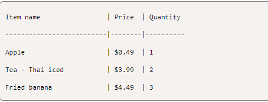

# python-challenge-1

Module 2 Challenge

## Food Truck Menu

This food truck menu system is designed to allow a customer to cycle through Main menu selections (Snacks, Meals, Drinks, Deserts), and then select items from Sub-menu's from each main menu category.

- The customer will be allowed to place an order, which includes storing the customer's order.

- Input validation to _check_ if the customer input menu selection is a number. If it isn't, _print_ an error message.

- To continue ordering or allow a exit, a **Match:Case** statement that checks for **Y** or **N**, and includes a _default_ option if neither letter is entered by the customer.

- Once the order is placed the receipt with the list of items ordered and total price of the order is _printed_.

    

### Sources

- Class Lessons
- Instructor
- Teacher Assistant
- Classmates
- Xpert Learning Assistant
- AskBCS
- Copilot
